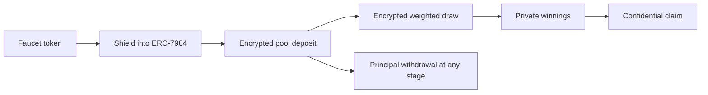

# ZamOps Pool

### Save privately. Win fairly. Keep your principal.

ZamOps Pool is a confidential no-loss prize-savings protocol built on [Zama FHEVM](https://docs.zama.ai/protocol). Savers Shield ERC-20 assets into ERC-7984 confidential tokens, deposit without publishing the amount, receive encrypted odds proportional to their savings, and remain free to withdraw their principal throughout the draw lifecycle.

**Live app:** [pool.zamops.xyz](https://pool.zamops.xyz)

| | |
|---|---|
| Application | [https://pool.zamops.xyz](https://pool.zamops.xyz) |
| Network | Ethereum Sepolia (`11155111`) |
| FHE | Zama FHEVM Solidity `0.11.1`, relayer SDK `0.4.1` |
| Confidential token standard | OpenZeppelin ERC-7984 |
| Activity index | Goldsky |
| Canonical factory | [`0xEB98…4Aa2`](https://sepolia.etherscan.io/address/0xEB98e21687d099d3c2F222E69fC728F1f6904Aa2) |
| Languages | English, Spanish, French, Simplified Chinese, Korean, Vietnamese |

## Understand the complete journey in three minutes

1. Connect MetaMask or Rabby on Sepolia and claim a faucet token.
2. Open **Tokens**, Shield part of the public balance, and reveal/hide confidential balances.
3. Deposit into a pool and explicitly reveal **Your principal**.
4. Open **Activity** and reveal the encrypted amount inline or in its detail sheet.
5. Show the automated draw status and permissionless delayed fallback.
6. Reveal winnings, claim the prize, then withdraw the unchanged principal.

The presentation-ready route is in the [demo guide](docs/judge-demo-guide.md). Existing on-chain journeys can be audited immediately in [testing and release evidence](docs/testing-and-release-evidence.md).

## The complete confidential flow

| Stage | What the saver does | What happens onchain |
|---|---|---|
| 1. Obtain | Requests a supported Sepolia test token | The sponsored faucet mints a public ERC-20 or transfers funded inventory |
| 2. Shield | Approves the wrapper and chooses a private amount | The Zama registry wrapper converts the ERC-20 into an ERC-7984 confidential balance |
| 3. Deposit | Authorizes the pool and submits an encrypted amount | The browser produces an encrypted input/proof; the pool credits encrypted principal and draw weight |
| 4. Reveal | Selects Reveal and signs a viewing request | EIP-712 user decryption reveals only the connected wallet's authorized value; it sends no transaction |
| 5. Draw | Waits for automation or uses the delayed fallback | Permissionless contract calls publicly verify only the aggregate, sample with FHE randomness and scan encrypted weights |
| 6. Claim | Reveals winnings, then claims a positive balance | The pool clears encrypted winnings and confidentially transfers the prize to the winner |
| 7. Withdraw | Requests up to the privately checked principal | Principal is confidentially returned at any lifecycle stage |

## Why this is different

Public prize pools reveal how much every saver contributes, making balances, odds and outcomes easy to profile. ZamOps Pool moves the important accounting and selection work into FHE:

- principal, per-user odds, prize reserves and winnings are encrypted;
- weighted selection scans encrypted cumulative balances against an encrypted random target;
- a winner learns through their decryptable winnings balance rather than a public winner event;
- indexed activity stores encrypted handles, so history can be restored without publishing readable amounts;
- all draw progression is permissionless—the keeper improves liveness but has no special draw authority.

## How it works



The pool keeps principal, prize reserve and winnings separate. Losing changes neither principal ownership nor withdrawal rights. The testnet keeper funds prizes with mock yield; it does not take funds from savers.

Each pool remains Open while its 60-minute timer counts down. During that window, savers can deposit and their encrypted balances become weight in the upcoming draw. `nextDrawAt` is the earliest time the draw may be triggered, not a transaction that fires by itself: the final encrypted weight snapshot is taken when the keeper or another permissionless caller submits `requestDraw()`.

Once `requestDraw()` is mined, the pool leaves Open and deposits pause until the draw finishes. The frontend disables **Deposit privately** and shows the paused state, while the contract independently rejects direct deposit attempts; this is an onchain rule, not only a UI guard. Withdrawals remain available throughout the draw. When `PoolReopened` completes the lifecycle, deposits become available again and a new 60-minute countdown begins.

Automation is scheduled every 10 minutes. A healthy draw therefore normally completes approximately **60–70 minutes after the pool reopens**, plus normal Sepolia and Zama decryption latency. If automation is delayed, the UI offers any wallet the next valid permissionless step after about 80 minutes.

### What triggers each draw stage

The timer, draw trigger and winner selection are separate operations:

| Stage | Onchain operation | Purpose |
|---|---|---|
| Open the round | `PoolReopened` | Starts the next 60-minute countdown and enables deposits |
| Trigger the due draw | `requestDraw()` | Checks the deadline and participants, freezes the encrypted weights and funded prize, closes deposits, and begins proof-backed draw processing; it does not pick the winner or start the timer |
| Start encrypted selection | `startSelection()` | Verifies the publicly decrypted combined eligible weight and creates encrypted random candidates with `FHE.randEuint64` |
| Select the weighted interval | `processSelectionBatch()` | Compares the encrypted random target with encrypted cumulative deposit ranges; larger deposits cover more of the range but every positive saver can win |
| Verify and award | `finalizeSelection()` | Verifies the selection result and credits the prize to the selected saver's encrypted winnings without emitting a readable winner or amount |
| Prepare the next round | `processNextDrawSyncBatch()` | Synchronizes encrypted weights after in-draw withdrawals, then emits `PoolReopened` and starts the next countdown |

For example, deposits of 10, 30 and 60 create approximately 10%, 30% and 60% chances in a 100-unit combined range. The 60-unit saver is most likely to win, but the encrypted random target can still select either smaller saver.

Read [draw fairness and accounting](docs/draw-fairness-and-accounting.md) for weighted selection, rejection sampling, empty draws and the no-loss invariant.

## Zama integration, end to end

The browser uses the Zama React/Relayer SDK to build encrypted `euint64` inputs for the exact destination contract. Solidity imports them with `FHE.fromExternal`, performs accounting and comparisons over ciphertexts, and explicitly grants contract, user and transient token permissions with the FHEVM ACL.

For selection, `FHE.randEuint64` samples encrypted candidates below the next power-of-two bound. Encrypted rejection sampling removes modulo bias; encrypted cumulative-weight comparisons select the winning interval. No offchain service receives plaintext balances or chooses the winner. The keeper only pays gas and submits permissionless lifecycle calls.

For viewing, the connected wallet signs an EIP-712 authorization. The Zama relayer checks that the user has ACL access to the current ciphertext handle and returns that value to the browser. Reveal does not publish the value or create an onchain transaction.

## Privacy at a glance

| Information | Visibility |
|---|---|
| Deposit, withdrawal and claim amounts | Encrypted; user-revealable when ACL permits |
| Principal, odds and winnings | Encrypted |
| Random target and individual selection comparisons | Encrypted |
| Winner identity | Not emitted as readable draw data |
| Aggregate eligible weight | Publicly decrypted for proof-backed progression |
| Wallet addresses, transaction timing and lifecycle state | Public blockchain metadata |

FHE provides value confidentiality, not anonymity. The complete boundary and ACL lifecycle are documented in [architecture and privacy](docs/architecture-and-privacy.md).

## No loss, with honest testnet yield

Principal, prize reserve and winnings are separate encrypted ledgers. Draw completion moves only the frozen prize reserve into one saver's winnings; it never moves another saver's principal. Withdrawals are available during Open, decryption, selection and synchronization states.

Sepolia prizes are separately funded mock yield. The keeper funds only participating, eligible pools according to explicit per-token policy. If the eligible aggregate is zero, the draw is cancelled and its encrypted prize returns to the reserve for a later valid draw. A production adapter could route real strategy yield into `fundPrize` while preserving the same custody boundary; strategy principal should never be treated as prize liquidity.

## Built for real wallet conditions

The interface distinguishes authorization signatures from transactions and translates missing approval, insufficient public or private balance, wrong network, unsupported assets, faucet cooldown/inventory, rejected signatures, stale ciphertexts, relayer failures and keeper delays into human-readable recovery steps. Hidden zero Claim or Withdraw balances are privately checked first, so the app shows an informational message without opening a zero-value transaction prompt.

Activity is reconstructed from Goldsky's public event projection. Indexed encrypted handles remain ciphertext; users can reveal an authorized amount inline or in its detail view. Clearing browser storage removes local presentation state, not the on-chain history.

## International by design

The entire application is available in English, Spanish, French, Simplified Chinese, Korean and Vietnamese. All six catalogs contain the same 257 typed messages, including wallet, encryption, draw, recovery and accessibility copy. Locale and light/dark preferences persist locally, while decrypted financial values do not.

## Canonical Sepolia deployment

### Infrastructure

| Contract / account | Address |
|---|---|
| Zama wrapper registry | [`0x2f07…128e`](https://sepolia.etherscan.io/address/0x2f0750Bbb0A246059d80e94c454586a7F27a128e) |
| ZamOps pool factory | [`0xEB98…4Aa2`](https://sepolia.etherscan.io/address/0xEB98e21687d099d3c2F222E69fC728F1f6904Aa2) |
| ZamOps faucet | [`0x6148…Cc9F`](https://sepolia.etherscan.io/address/0x6148D5A8B6023CC52aC3cc71d22a7340B5b2Cc9F) |
| Keeper | [`0xcc88…1c54`](https://sepolia.etherscan.io/address/0xcc886a72f79BaEd0098432704a65373F52131c54) |
| Faucet sponsor | [`0xd04B…3AF1`](https://sepolia.etherscan.io/address/0xd04BBA49865f57840D4F03CCf541961906843AF1) |

### Pools

| Asset | Confidential wrapper | Pool | Prize mode |
|---|---|---|---|
| cUSDC | [`0x7c5b…3639`](https://sepolia.etherscan.io/address/0x7c5bf43b851c1dff1a4fee8db225b87f2c223639) | [`0x2Eeb…D327`](https://sepolia.etherscan.io/address/0x2Eeb28cB5fF0C3339163e3779794ac8a19BCD327) | Keeper mock yield: 50 |
| cUSDT | [`0x4e7b…4491`](https://sepolia.etherscan.io/address/0x4e7b06d78965594eb5ef5414c357ca21e1554491) | [`0x2411…dAf6`](https://sepolia.etherscan.io/address/0x2411d25929564Dc89502d02d502Be295703DdAf6) | Keeper mock yield: 25 |
| cWETH | [`0x4620…3158`](https://sepolia.etherscan.io/address/0x46208622da27d91db4f0393733c8ba082ed83158) | [`0xd913…F41a`](https://sepolia.etherscan.io/address/0xd91358f869b26B9Ef61AA7A900111A98109CF41a) | Keeper mock yield: 1 |
| cBRON | [`0xaa56…c891`](https://sepolia.etherscan.io/address/0xaa5612fa27c927a0c7961f5aefee5ba3a0f9c891) | [`0x95cc…0452`](https://sepolia.etherscan.io/address/0x95cc93C58F5386f1420F67F2C8ceBd8C05450452) | Keeper mock yield: 100 |
| cZAMA | [`0xf2d6…bfb`](https://sepolia.etherscan.io/address/0xf2d628d2598af4eaf94cb76a437ff86ca78ffbfb) | [`0x9820…0675`](https://sepolia.etherscan.io/address/0x9820488e1A5c7Dca5D57387c5f5D8ac35f140675) | Keeper mock yield: 100 |
| ctGBP mock | [`0xfce5…f7cc`](https://sepolia.etherscan.io/address/0xfce5c7069c5525ef6c8c2b2e35a745ba20a2f7cc) | [`0xbbcA…6bE8`](https://sepolia.etherscan.io/address/0xbbcAc223967DCF3dBfD6fbeC3D47AB98cCDf6bE8) | Keeper mock yield: 50 |
| cXAUt | [`0xe4fc…60c7`](https://sepolia.etherscan.io/address/0xe4fcf848739845bc81dee1d5352cf3844f0a60c7) | [`0x1858…2E05`](https://sepolia.etherscan.io/address/0x1858B04892E3017F783dF51C21A191a88A452E05) | Keeper mock yield: 1 |
| ctGBP inventory | [`0x167d…a208`](https://sepolia.etherscan.io/address/0x167dc962808b32cfffc7e14b5018c0be06a3a208) | [`0x88CD…b427`](https://sepolia.etherscan.io/address/0x88CDE42A020956167FA2c79Ffa26D7B5918Fb427) | Sponsor inventory required |
| csteakcUSDC | [`0x13f7…28c4`](https://sepolia.etherscan.io/address/0x13f7d34a4f0102734f19e3ff16e068fe194b28c4) | [`0x29c1…f9a1`](https://sepolia.etherscan.io/address/0x29c1b12004E649cF67E3a2A37Fc24A91Bd9bf9a1) | Sponsor inventory required |

Optional Etherscan source publication can be run with `npm --prefix contracts run verify:canonical:sepolia`. Verification is not required to exercise the deployed contracts, and every address links directly to its Sepolia activity and bytecode.

## Bounty requirement coverage

| Requirement | Implementation and proof |
|---|---|
| Public web dApp | Live Sepolia wallet application at [pool.zamops.xyz](https://pool.zamops.xyz) |
| Deposit → draw → claim → withdraw | Completed on canonical cUSDC and fresh-wallet cUSDT journeys |
| Encrypted deposits and balances | ERC-7984 custody plus `euint64` principal, weights, prize reserve and winnings |
| Weighted onchain FHE randomness | `FHE.randEuint64`, unbiased encrypted rejection sampling and encrypted prefix selection |
| No offchain RNG or plaintext balances | Draw computation lives in `ConfidentialPrizePool`; the keeper has no selection privilege |
| Documented leakage | Explicit encrypted/public table plus aggregate, timing and metadata limitations |
| No-loss principal | Separate accounting and withdrawal in every draw state, covered by tests and Sepolia journeys |
| Automated/documented draws | Ten-minute keeper, health reports and delayed permissionless fallback |
| EIP-712 user decryption | Connected-wallet principal, winnings, token balance and indexed-activity reveals |
| Faucet and test assets | Sponsored faucet for public-mint assets; truthful inventory handling for restricted assets |
| Zama frontend integration | React SDK, relayer-backed encryption/decryption and viem/wagmi wallet clients |
| Error handling | Approval, balance, network, token, faucet, decryption and automation recovery paths |
| Open source | Contracts, frontend, indexer, keeper, tests and documentation live in this repository |

## Tested evidence

| Layer | Result | Evidence |
|---|---|---|
| Solidity | 24 passing tests | Confidential accounting, draw boundaries, retries, lifecycle, ACLs, faucet and limits |
| cUSDC | Complete three-wallet journey | 10/30/60 deposits, 50 prize, claim, all principal withdrawn |
| cUSDT | Complete fresh-wallet smoke | Faucet, Shield, deposit, draw, claim, withdraw, final zero |
| Permissionless fallback | Passed | Unprivileged request followed by automated completion |
| Goldsky restore | Passed | Activity recovered after browser storage clear |
| Indexed private amounts | Passed | Deposit, withdrawal and positive/zero claim handles decrypted |
| FHE measurements | Captured | Gas, HCU, max depth and decryption timing |

Every canonical transaction link and measurement is in [testing and release evidence](docs/testing-and-release-evidence.md).

## Run locally

Requirements: Node.js 20+, npm, a Sepolia RPC URL, and a browser wallet on Sepolia.

```bash
git clone https://github.com/Femtech-web/Zamops-Pool.git
cd Zamops-Pool

cp contracts/.env.example contracts/.env
cp app/.env.example app/.env

npm --prefix contracts install
npm --prefix app install
npm --prefix contracts run compile
npm --prefix contracts test
npm --prefix app run dev
```

Open `http://localhost:3000`. Environment variables are documented in the example files. Keep private keys server-side. Production deployments must set `NEXT_PUBLIC_SITE_URL=https://pool.zamops.xyz` before building so canonical, Open Graph, sitemap and manifest URLs use the public origin.

## Release checks

```bash
npm --prefix contracts test
npm --prefix app run lint
npm --prefix app run typecheck
npm --prefix app run build
```

## Deployment and operations scripts

| Purpose | Command |
|---|---|
| Compile contracts | `npm --prefix contracts run compile` |
| Deploy the canonical Sepolia pool infrastructure | `npm --prefix contracts run deploy:sepolia:pools` |
| Optionally publish canonical sources on Etherscan | `npm --prefix contracts run verify:canonical:sepolia` |
| Run the multi-pool Sepolia keeper once | `npm --prefix contracts run keeper:sepolia` |
| Submit one permissionless recovery step | `npm --prefix contracts run fallback:sepolia` |
| Build the production frontend | `npm --prefix app run build` |

Contract deployment and keeper commands read server-only Sepolia configuration from `contracts/.env` or GitHub Actions secrets and variables. Frontend public configuration is listed in `app/.env.example`. Constructor arguments, canonical addresses, keeper controls, health thresholds and recovery procedures are documented in [deployment and operations](docs/deployment-and-operations.md).

## Repository map

| Path | Purpose |
|---|---|
| `contracts/contracts/` | Pool, factory, faucet, interfaces and test harnesses |
| `contracts/test/` | Confidential contract test suite |
| `contracts/scripts/` | Keeper, fallback, verification and Sepolia rehearsals |
| `app/src/app/` | Next.js App Router routes and metadata |
| `app/src/features/` | Pool, token, activity and shell features |
| `app/src/i18n/` | Complete EN, ES, FR, ZH, KO and VI catalogs |
| `subgraph/` | Goldsky indexing schema and mappings |
| `.github/workflows/` | Keeper automation and health reporting |
| `docs/` | Public architecture, security, testing, operations and demo docs |

## Documentation

- [Documentation index](docs/README.md)
- [Architecture and privacy](docs/architecture-and-privacy.md)
- [Draw fairness and accounting](docs/draw-fairness-and-accounting.md)
- [Deployment and operations](docs/deployment-and-operations.md)
- [Testing and release evidence](docs/testing-and-release-evidence.md)
- [Security and limitations](docs/security-and-limitations.md)
- [Judge demo guide](docs/judge-demo-guide.md)

## Security posture

Pools are non-upgradeable and have no owner, pause key or winner override. The keeper has no privileged contract path. This remains a Sepolia prototype using mock yield and has not been independently audited; the concrete limitations and mainnet requirements are listed in [security and limitations](docs/security-and-limitations.md).

## License

MIT
