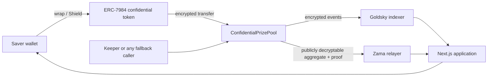

# Architecture and privacy

ZamOps Pool is a shared, no-loss prize-savings prototype on Zama's Sepolia FHEVM. Savers keep an encrypted principal balance, receive encrypted odds proportional to that principal, and can withdraw principal independently of the prize result.

## Confidentiality boundary

| Data | Visibility | Reason |
|---|---|---|
| Deposit, withdrawal, claim, principal and winnings amounts | Encrypted | Values are represented by FHE handles and are only user-decryptable when ACL permissions allow it |
| Individual draw weights and random target | Encrypted | Selection is evaluated over ciphertexts |
| Winner identity and prize value | Not emitted as readable draw data | The winner learns through their decryptable winnings balance |
| Aggregate eligible weight | Public during draw progression | The contract explicitly marks the snapshot decryptable so a proof-backed draw step can proceed |
| Wallet participation, timestamps, contract calls and transaction hashes | Public | These are ordinary blockchain metadata |
| Draw lifecycle and participant count | Public | Required for permissionless progress and monitoring |

Encryption hides values, not the existence or timing of activity. The UI says this directly and never describes the system as anonymous.

## Encrypted data lifecycle

1. The browser creates an encrypted input and proof for the destination contract.
2. The pool validates the encrypted input, grants transient token access, and performs an ERC-7984 confidential transfer.
3. The pool stores principal, odds, prize reserves and winnings as encrypted `euint64` values.
4. Stored values grant contract access with `FHE.allowThis`; user-readable balances also grant the relevant saver access with `FHE.allow`.
5. The browser requests an EIP-712-based user decryption permit when the saver chooses Reveal.
6. Encrypted activity handles are indexed by Goldsky. The index is evidence and discovery infrastructure; it does not turn ciphertext into a readable amount.

The app does not persist decrypted amounts. Revealed values live in component memory and disappear when hidden, navigated away from, or refreshed.

## Draw boundary

Most of the draw remains encrypted. A draw freezes its current weight and prize snapshots, publishes only the aggregate-weight handle for verifiable public decryption, samples an encrypted target, and scans encrypted cumulative weights in bounded batches. A proof-backed boolean confirms whether a valid winner was found; it does not reveal the winner.

Read [draw fairness and accounting](draw-fairness-and-accounting.md) for the full lifecycle.

