# Draw fairness and accounting

## The no-loss invariant

The pool keeps three concepts separate:

- **Principal:** the saver-owned balance, withdrawable at every draw stage.
- **Prize reserve:** separately funded mock yield; it never comes from principal.
- **Winnings:** an encrypted award credited to the selected saver and claimed separately.

Depositing increases principal and the next eligible draw weight. Withdrawing reduces principal and, where lifecycle state permits, the matching eligible weight. Claiming clears only winnings. A prize award never reduces another saver's principal.

This is a hackathon savings model, not a real yield integration. The configured keeper funds test-token prizes to make the full product journey repeatable.

## Weighted encrypted selection

For weights `w₁ … wₙ`, the contract snapshots total weight `T`, selects a uniform encrypted target in `[0, T)`, and awards the prize to the first participant whose cumulative weight exceeds the target. A saver with weight `wᵢ` therefore occupies `wᵢ` target positions and has probability `wᵢ / T`.

FHE random generation is power-of-two bounded. When `T` is not a power of two, the contract uses bounded rejection sampling: it draws several candidates, selects the first candidate below `T`, and retries the draw selection if no candidate is valid. This avoids modulo bias.

## Lifecycle

```mermaid
stateDiagram-v2
  [*] --> Open
  Open --> AwaitingTotalDecryption: requestDraw
  AwaitingTotalDecryption --> Selecting: verify aggregate proof
  AwaitingTotalDecryption --> Syncing: aggregate is zero
  Selecting --> AwaitingResultDecryption: process batches
  AwaitingResultDecryption --> Selecting: no valid candidate; retry
  AwaitingResultDecryption --> Syncing: winner found
  Syncing --> Open: rebuild next-draw weights
```

Selection and resynchronization are batched to keep each transaction bounded. The deployed prototype supports at most 64 participants per pool and processes at most 8 per batch.

## Empty draws and unused mock yield

The keeper does not fund or request a draw when a pool has no registered participants. If a draw reaches aggregate verification with zero eligible weight, it is cancelled and the encrypted draw prize is returned to the pool's prize reserve. It is not sent back to the token contract, burned, or awarded to an empty draw; it remains available for a future valid draw.

## Permissionless progress

The keeper is convenience automation, not draw authority. Every draw-advancement function is permissionless. If automation stalls, the application exposes the next valid draw step after a delay, allowing any wallet to continue the same state machine.

